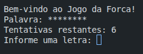
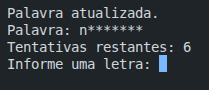
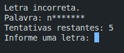
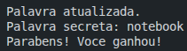
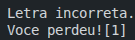

# Projeto do Jogo da Forca - Cadeira de Fundamentos de Programação(FUP)

Ao executar o programa, ele exibirá a seguinte tela:

Após o usuário informar uma letra, a palavra será atualizada:

Caso o usuário informe a letra errada, a palavra continuará censurada e as tentativas restantes irão diminuir:

Depois que o usuário digitar todas as letras corretas, aparecerá a seguinte tela:

Caso o usuário perca todas as suas tentativas restantes, aparecerá a seguinte tela:

- Professor: **Claro Henrique**